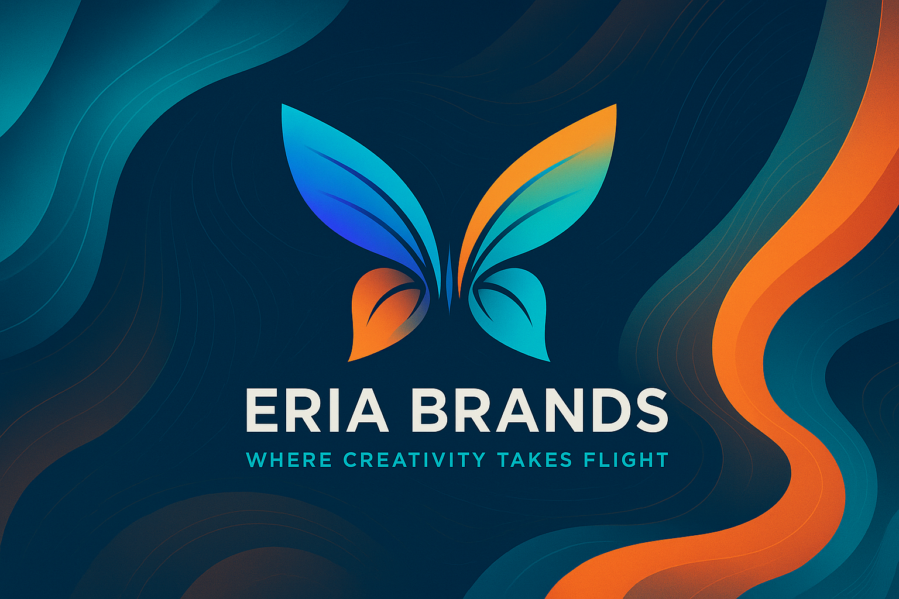

  <!-- Cover Banner -->
  

  <!-- Title with Logo -->
  <h1>
    
    Eria Brands
  </h1>
  
<em>Where Creativity Takes Flight</em>

  
  
  

---

## 🚀 About Eria Brands

Eria Brands is a Manila-based digital agency guiding brands through an **Evolution, Revolution, Ascension** journey. We craft human-centered experiences that leave a lasting impact.

  

## 🎨 Core Services

<table>
  <tr>
    <td align="center">
      <strong>Brand Strategy & Identity</strong> 
      Defining your brand story
    </td>
    <td align="center">
      <strong>Web & Mobile Development</strong> 
      High-performance digital products
    </td>
  </tr>
  <tr>
    <td align="center">
      <strong>Digital Marketing & Ads</strong> 
      Targeted campaigns that convert
    </td>
    <td align="center">
      <strong>Video Production & Storytelling</strong> 
      Engaging visual narratives
    </td>
  </tr>
  <tr>
    <td align="center">
      <strong>UX/UI Design</strong> 
      Intuitive user experiences
    </td>
    <td align="center">
      <strong>Local SEO & Maps</strong> 
      Be found where it matters
    </td>
  </tr>
</table>

---

## 🛠️ Technology Stack

  
  
  
  
  
  

---

## 📈 GitHub Stats

  

---

## 📫 Get in Touch

  🌐 [eriabrands.com](https://eriabrands.com) &nbsp;•&nbsp;  
  📧 [info@eriabrands.com](mailto:info@eriabrands.com) &nbsp;•&nbsp;  
  🔗 [LinkedIn](https://www.linkedin.com/company/eriabrands)

---

*Join the transformation—let Eria Brands elevate your brand’s journey.*
